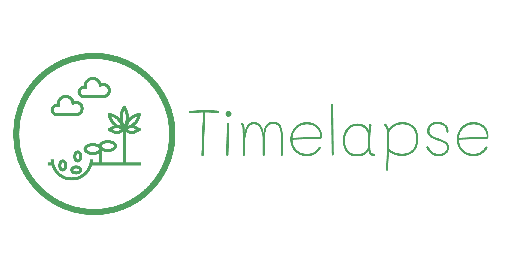

# Project 3: TimeLapse

  

## :clipboard: Table of Contents

- [Description](#description)
- [Tech-Stack](#-Tech-Stack)
- [Installation](#-Installation)
- [Usage](#-Usage)
- [Tests](#Tests)
- [License](#License)

## ✨ Description

Timelapse generates animated timelapse GIFs based on images that are uploaded by users over a specified time and frequency.

The application offers a simple, intuitive interface that guides users through the process of creating their own GIF animations. Users can choose the length of time for the period between each image capture, allowing them to create amazing timelapsed GIFs that range from a few seconds to several minutes in length.

Users can then easily share their finished GIFs with others, whether through social media or other online channels, making it a great tool for personal or professional use.

Overall, an application that generates a GIF based on multiple image uploads is a powerful, fun, and creative tool that allows anyone to create unique and engaging timelapse animations that don't take up a lot of memory (like video) and capture their personal or professional experiences in a dynamic and engaging way.

## 👨‍💻Tech-Stack

Here's a brief high-level overview of the tech stack that was used to build Timelapse:

- MERN stack used for frontend and backend development (MongoDB, Express, React, and Node.js)

We also used several  packages for various functions of the application including:

- Multer for handling `multipart/form-data` used to upload files/images into our database
- Nodemailer for sending scheduled reminder emails for users to snap photos and upload them to Timelapse
- MAG (`make-a-gif`) for GIF generator
- Firebase for secure login   

## 💾 Installation

To run a version of the application on your localhost do the following:

1. Clone this git repo to your computer
2. Launch a terminal type `npm install` to install of the necessary depndencies and npm packages 
3. Once all dependencies are installed type `npm run develop` which will concurrently run the server and client 

## 🤹 Usage

Once installation is complete and the browser loads, register an account my entering requested information. After registering, login and follow instructions on generating a new timelapse project, have fun!  

## ✔️ Tests

N/A

## ⚠️ License

Timelapse is free and open-source software licensed under the 

## :scroll: Credits

* Martha Benitez 
* Jasper Cheng
* Sam De Marco
* Jon Ledo
* Kay-Ann Williams
